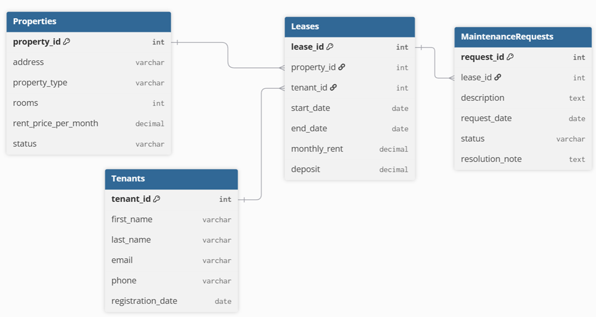

# Homework 2: Проектирование базы данных для управления арендной недвижимостью

---

## Part 1: Выбор Сценария

**Управление арендной недвижимостью:** Отслеживание арендной недвижимости, арендаторов, договоров аренды и запросов на обслуживание.

---

## Part 2: Проектирование Базы Данных и Документация

### Идентификация Сущностей и Атрибутов

1. Объекты недвижимости (Properties)
2. Арендаторы (Tenants)
3. Договоры аренды (Leases)
4. Заявки на обслуживание (MaintenanceRequests)

### Проектирование Таблиц

#### 1. Table Name: `Properties`

**Description:** Хранит информацию об объектах недвижимости, сдаваемых в аренду.

**Attributes:**

| Атрибут | Тип данных | Ограничения |
|---|---|---|
| PropertyID | INTEGER | PK, NOT NULL, UNIQUE |
| Address | VARCHAR(255) | NOT NULL |
| PropertyType | VARCHAR(50) | NOT NULL |
| Rooms | INTEGER | |
| RentPricePerMonth | DECIMAL(10,2) | NOT NULL |
| Status | VARCHAR(20) | DEFAULT 'available' |

**Constraints:**

- `PK_Properties`: PRIMARY KEY (PropertyID)
- `CHK_Rooms`: CHECK (Rooms >= 1)
- `CHK_RentPrice`: CHECK (RentPricePerMonth > 0)
- `CHK_Status`: CHECK (Status IN ('available', 'rented', 'under maintenance'))

---

#### 2. Table Name: `Tenants`

**Description:** Хранит данные об арендаторах (физических или юридических лицах).

**Attributes:**

| Атрибут | Тип данных | Ограничения |
|---|---|---|
| TenantID | INTEGER | PK, NOT NULL, UNIQUE |
| FirstName | VARCHAR(100) | NOT NULL |
| LastName | VARCHAR(100) | NOT NULL |
| Email | VARCHAR(255) | UNIQUE |
| Phone | VARCHAR(20) | |
| RegistrationDate | DATE | DEFAULT CURRENT_DATE |

**Constraints:**

- `PK_Tenants`: PRIMARY KEY (TenantID)
- `UQ_Email`: UNIQUE (Email)

---

#### 3. Table Name: `Leases`

**Description:** Связывает объекты и арендаторов, фиксирует условия аренды (период, стоимость). Реализует связь «многие-ко-многим» между Properties и Tenants.

**Attributes:**

| Атрибут | Тип данных | Ограничения |
|---|---|---|
| LeaseID | INTEGER | PK, NOT NULL, UNIQUE |
| PropertyID | INTEGER | FK (REFERENCES Properties), NOT NULL |
| TenantID | INTEGER | FK (REFERENCES Tenants), NOT NULL |
| StartDate | DATE | NOT NULL |
| EndDate | DATE | |
| MonthlyRent | DECIMAL(10,2) | NOT NULL |
| Deposit | DECIMAL(10,2) | |

**Constraints:**

- `PK_Leases`: PRIMARY KEY (LeaseID)
- `FK_Leases_Properties`: FOREIGN KEY (PropertyID) REFERENCES Properties(PropertyID)
- `FK_Leases_Tenants`: FOREIGN KEY (TenantID) REFERENCES Tenants(TenantID)
- `CHK_Dates`: CHECK (EndDate IS NULL OR EndDate >= StartDate)
- `CHK_MonthlyRent`: CHECK (MonthlyRent > 0)

---

#### 4. Table Name: `MaintenanceRequests`

**Description:** Хранит заявки на обслуживание или ремонт, поданные арендаторами.

**Attributes:**

| Атрибут | Тип данных | Ограничения |
|---|---|---|
| RequestID | INTEGER | PK, NOT NULL, UNIQUE |
| LeaseID | INTEGER | FK (REFERENCES Leases), NOT NULL |
| Description | TEXT | NOT NULL |
| RequestDate | DATE | NOT NULL, DEFAULT CURRENT_DATE |
| Status | VARCHAR(20) | DEFAULT 'new' |
| ResolutionNote | TEXT | |

**Constraints:**

- `PK_MaintenanceRequests`: PRIMARY KEY (RequestID)
- `FK_MaintenanceRequests_Leases`: FOREIGN KEY (LeaseID) REFERENCES Leases(LeaseID)
- `CHK_Status`: CHECK (Status IN ('new', 'in progress', 'resolved'))

---

### Взаимосвязи

#### Properties и Leases (Один-ко-Многим)

Один объект недвижимости может участвовать в нескольких договорах аренды (в разные периоды времени или с разными арендаторами). Каждая запись о договоре аренды относится к одному конкретному объекту.

`Leases.PropertyID` является внешним ключом, ссылающимся на `Properties.PropertyID`.

---

#### Tenants и Leases (Один-ко-Многим)

Один арендатор может заключить множество договоров аренды (арендовать разные объекты или один и тот же объект в разное время). Каждый договор связан с одним арендатором.

`Leases.TenantID` является внешним ключом, ссылающимся на `Tenants.TenantID`.

---

#### Связь «Многие-ко-Многим» между Properties и Tenants (реализована через таблицу Leases)

Один объект может быть арендован разными арендаторами (в разные периоды), и один арендатор может арендовать разные объекты.

Таблица `Leases` выступает связующей (ассоциативной) сущностью, которая фиксирует каждый отдельный договор и позволяет отслеживать историю аренды.

---

#### Leases и MaintenanceRequests (Один-ко-Многим)

Один договор аренды может породить несколько заявок на обслуживание (например, поломка сантехники, проблемы с электричеством). Каждая заявка привязана к конкретному договору.

`MaintenanceRequests.LeaseID` является внешним ключом, ссылающимся на `Leases.LeaseID`.

---

## Part 3: ER-Диаграмма

