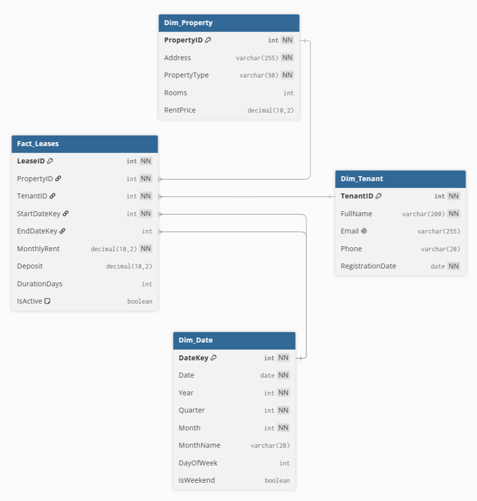

# Проектирование Data Warehouse

## 1. Выбор бизнес-процесса

**Сценарий:** Управление арендной недвижимостью  
**Бизнес-процесс:** Учёт и анализ договоров аренды  

Данный процесс направлен на мониторинг и анализ договоров аренды: количество заключённых договоров, их распределение по типам недвижимости, длительность, статус (активный/завершённый), а также оценка арендаторов по суммарной месячной ставке. Результаты помогают управлять портфелем объектов, понимать загруженность и предпочтения арендаторов.

---

## 2. Уровень детализации (Grain)

**Grain:** одна запись в таблице фактов = один договор аренды (Lease).

Каждая запись соответствует уникальному договору, заключённому между арендатором и владельцем объекта. Модель предназначена для анализа **статических характеристик договора** (месячная ставка, срок, статус) без учёта ежемесячных платежей во времени – для финансового анализа по месяцам потребовалась бы отдельная фактовая таблица с начислениями.

---

## 3. Таблицы измерений и фактов
### Таблица фактов: `Fact_Leases`

Хранит метрики по каждому договору аренды. Является центром звездообразной схемы.

| Колонка        | Тип                       | Описание                                                            |
| -------------- | ------------------------- | ------------------------------------------------------------------- |
| `LeaseID`      | `INT` (PK)                | Уникальный идентификатор договора                                   |
| `PropertyID`   | `INT` (FK → Dim_Property) | Идентификатор объекта                                               |
| `TenantID`     | `INT` (FK → Dim_Tenant)   | Идентификатор арендатора                                            |
| `StartDateKey` | `INT` (FK → Dim_Date)     | Дата начала аренды                                                  |
| `EndDateKey`   | `INT` (FK → Dim_Date)     | Дата окончания аренды (NULL, если активна)                          |
| `MonthlyRent`  | `DECIMAL(10,2)`           | Фиксированная арендная плата по договору                            |
| `Deposit`      | `DECIMAL(10,2)`           | Сумма залога                                                        |
| `DurationDays` | `INT`                     | Длительность договора в днях (вычисляется как разница между датами) |
| `IsActive`     | `BOOLEAN`                 | Активен ли договор в текущий момент                                 |

### Измерение: `Dim_Property`

Характеристики объектов недвижимости.

| Колонка        | Тип             | Описание                               |
| -------------- | --------------- | -------------------------------------- |
| `PropertyID`   | `INT` (PK)      | Идентификатор объекта                  |
| `Address`      | `VARCHAR(255)`  | Адрес                                  |
| `PropertyType` | `VARCHAR(50)`   | Тип недвижимости (квартира, дом, офис) |
| `Rooms`        | `INT`           | Количество комнат                      |
| `RentPrice`    | `DECIMAL(10,2)` | Текущая рыночная цена объекта          |

### Измерение: `Dim_Tenant`

Данные арендаторов.

| Колонка            | Тип            | Описание                      |
| ------------------ | -------------- | ----------------------------- |
| `TenantID`         | `INT` (PK)     | Идентификатор арендатора      |
| `FullName`         | `VARCHAR(200)` | Полное имя                    |
| `Email`            | `VARCHAR(255)` | Электронная почта (уникально) |
| `Phone`            | `VARCHAR(20)`  | Телефон                       |
| `RegistrationDate` | `DATE`         | Дата регистрации в системе    |

### Измерение: `Dim_Date`

Справочник дат для временных срезов.

| Колонка     | Тип           | Описание                    |
| ----------- | ------------- | --------------------------- |
| `DateKey`   | `INT` (PK)    | Ключ даты (формат YYYYMMDD) |
| `Date`      | `DATE`        | Полная дата                 |
| `Year`      | `INT`         | Год                         |
| `Quarter`   | `INT`         | Квартал (1–4)               |
| `Month`     | `INT`         | Месяц (1–12)                |
| `MonthName` | `VARCHAR(20)` | Название месяца             |
| `DayOfWeek` | `INT`         | День недели (1–7)           |
| `IsWeekend` | `BOOLEAN`     | Признак выходного дня       |

---

## 4. Схема модели
Выбрана **звёздообразная схема (Star Schema)**.

- **Одна таблица фактов** в центре.
- **Три таблицы измерений** – каждый луч звезды.
- Все связи направлены от факта к измерениям по внешним ключам.
- Между измерениями связей нет.

Такая архитектура обеспечивает высокую производительность аналитических запросов и простоту понимания бизнес-пользователями.

---

## 5. Диаграмма


---

## 6. Примеры аналитических запросов

Ниже приведены запросы, соответствующие заявленному grain (один договор). Все запросы написаны для PostgreSQL.

### Запрос 1: Количество новых договоров по месяцам

**Бизнес-вопрос:** Как меняется число заключаемых договоров по месяцам?

``` sql
SELECT 
    d.Year,
    d.Month,
    d.MonthName,
    COUNT(*) AS NewLeases
FROM Fact_Leases f
JOIN Dim_Date d ON f.StartDateKey = d.DateKey
GROUP BY d.Year, d.Month, d.MonthName
ORDER BY d.Year, d.Month;
```

### Запрос 2: Средняя арендная плата по типам недвижимости
**Бизнес-вопрос:** Какой тип недвижимости приносит наибольшую среднюю арендную плату?

``` sql
SELECT 
    p.PropertyType,
    AVG(f.MonthlyRent) AS AvgRent,
    COUNT(*) AS LeaseCount
FROM Fact_Leases f
JOIN Dim_Property p ON f.PropertyID = p.PropertyID
GROUP BY p.PropertyType
ORDER BY AvgRent DESC;
```

### Запрос 3: Количество активных договоров по объектам

**Бизнес-вопрос:** На каких объектах сейчас действует наибольшее количество договоров?

``` sql
SELECT 
    p.Address,
    p.PropertyType,
    COUNT(*) AS ActiveLeases
FROM Fact_Leases f
JOIN Dim_Property p ON f.PropertyID = p.PropertyID
WHERE f.IsActive = TRUE
GROUP BY p.Address, p.PropertyType
ORDER BY ActiveLeases DESC;
```

### Запрос 4: Арендаторы с наибольшей суммарной месячной ставкой по договорам

**Бизнес-вопрос:** Какие арендаторы имеют наибольшую суммарную месячную ставку по всем своим договорам?

``` sql
SELECT 
    t.FullName,
    SUM(f.MonthlyRent) AS TotalMonthlyRent,
    COUNT(*) AS NumberOfLeases
FROM Fact_Leases f
JOIN Dim_Tenant t ON f.TenantID = t.TenantID
GROUP BY t.FullName
ORDER BY TotalMonthlyRent DESC
LIMIT 3;
```

### Запрос 5: Количество новых договоров по кварталам
**Бизнес-вопрос:** Как меняется количество заключаемых договоров по кварталам (сезонность)?

``` sql
SELECT 
    d.Year,
    d.Quarter,
    COUNT(*) AS NewLeases
FROM Fact_Leases f
JOIN Dim_Date d ON f.StartDateKey = d.DateKey
GROUP BY d.Year, d.Quarter
ORDER BY d.Year, d.Quarter;
```

---